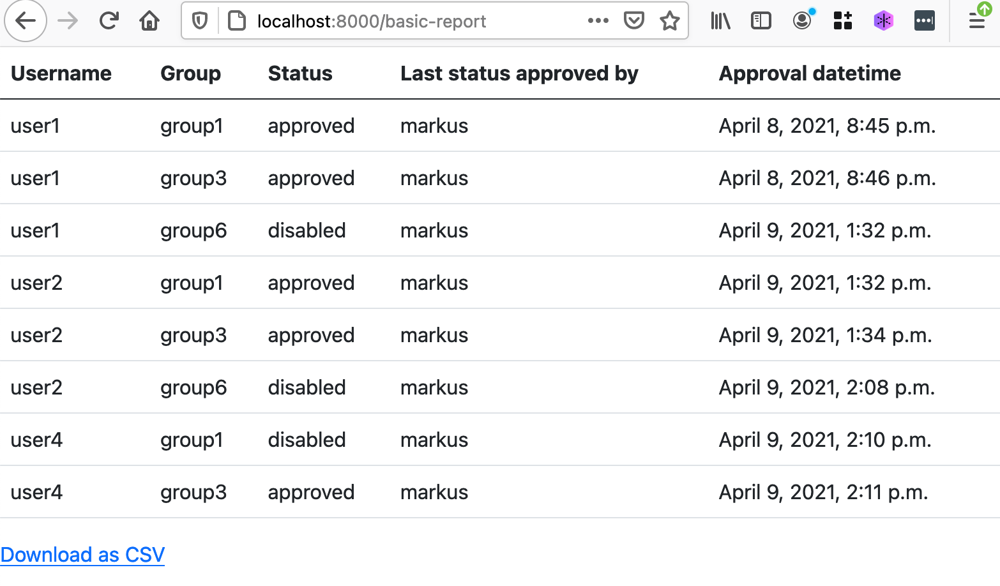

# django-real-open-idm-demo
[](https://travis-ci.com/markusleh/django-real-open-idm-demo) 


# Demo
https://django-real-idm.herokuapp.com/admin

user: `demo`

password: `demodemo`

# Getting started

## Prerequisites

- python3.6 or newer
- Latest Ubuntu preferred. Tested with Ubuntu 20.04

## Install

1. Install requirements

```
pip install -r requirements/dev.txt
```

2. Initiate Django

```
# run in folder with manage.py
python manage.py makemigrations
python manage.py makemigrations djangorealidm
python manage.py migrate
python manage.py createsuperuser
```

3. Load demo data (optional)

```
# run in folder with manage.py

python manage.py loaddata */fixtures/*.json
```


4. Run

```
# run in folder with manage.py
python manage.py runserver
```

## Try out


1. Go to `http://localhost:8000/admin/auth/user/` and add your account (which you created using `createsuperuser` to django existing group `approver`

2. Navigate to `http://localhost:8000/admin/djangorealidm/grant/` and try to create a new grant.

# Utils

## AD: Sync approved Group membership to Active Directory

Example

Create new function in the admin-ui e.g. `function name: sync-ad`
```python
from djangorealidm.utils import Sync
from djangorealidm.models import Group, User, Grant
from river.models import State

def handle(context):
  s = Sync()
  # TODO: Add role sync
  approved_status = status=State.objects.get(slug="approved")
  groups = [group.name for group in Group.objects.all()]
  for group in groups:
  	users = [grant.user.username for grant in Grant.objects.filter(
  	    status=approved_status, 
  	    group__name=group,
  	    status_transition_approvals__isnull=False # Retrieve grants for which approval has been explicitly granted. Prevents creating grant objects with 'approved' status
  	    )]
 
  	s.sync_users_groups(users, [group])
```

Add LDAP configuration parameters in `settings.py`
```
REAL_IDM = {
    'LDAP_SERVER': "",          # required, server address e.g. '192.168.1.1'
    'SEARCH_BASE': "",          # required, where the groups and users are located e.g. 'dc=win,dc=local'
    'BIND_USER': "",            # optional, bind user e.g. bind@win.local
    'BIND_PASSWD': "",          # optional
    'LDAP_USER_ATTRIBUTE': ""   # optional, mapping for User.username and AD attribute name used to search the user from AD. Defaults to 'sAMAccountName'
}
```
Create a new `On-approved hook` to sync group membership status after new approvals have been made and attach it to your workflow.


# Other features
## Reports

Go to `http://localhost:8000/` for full list of reports available. Currently you are able to:

- View a basic report about current grants
- View a report about past approvals (history-report)
- Export reports to CSV



 ## Objects
 
 ### Roles
 Roles are collections of groups which can be assigned to users if needed to ensure similar level of access to multiple users.
 
 
 Note: role grants and group grants can exist simultaneously. Always consider that more specific grants should override less specific ones. E.g. `user1` with `disabled` group grant in `group1` should override an approved role grant which contains `group1`. 
