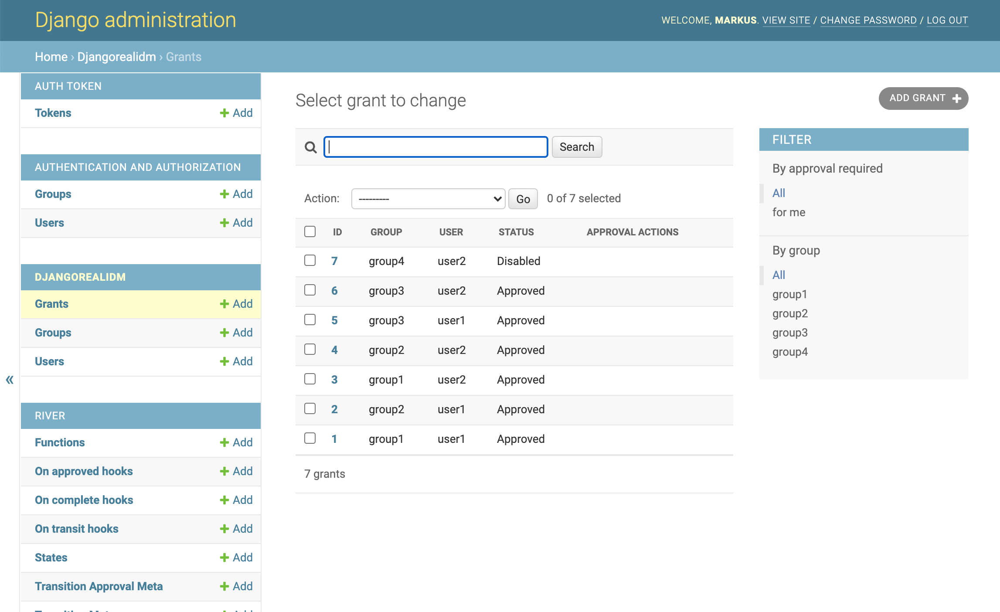
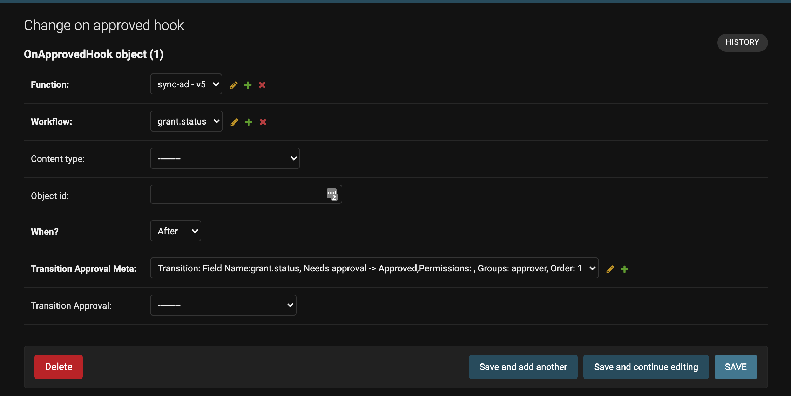

# django-real-open-idm-demo
[](https://travis-ci.com/markusleh/django-real-open-idm-demo) 



##### Table of Contents  
- [Demo](#demo)
- [Getting started](#getting-started)
  * [Prerequisites](#prerequisites)
  * [Install](#install)
  * [Docker Install](#docker-install)
  * [Try out](#try-out)
- [Settings](#settings)
  * [Module: LDAP](#module--ldap)
- [Utils](#utils)
  * [AD: Sync approved Group membership to Active Directory](#ad--sync-approved-group-membership-to-active-directory)
- [Other features](#other-features)
  * [Reports](#reports)
  * [Objects](#objects)
    + [Roles](#roles)

# Demo
https://django-real-idm.herokuapp.com/admin

user: `demo`

password: `demodemo`

# Getting started

## Prerequisites

- python3.6 or newer
- Latest Ubuntu preferred. Tested with Ubuntu 20.04

## Install

1. Install requirements

```
pip install -r requirements/dev.txt
```

2. Initiate Django

```
# run in folder with manage.py
python manage.py makemigrations
python manage.py migrate
python manage.py createsuperuser
```

3. Load demo data (optional)

```
# run in folder with manage.py

python manage.py loaddata */fixtures/*.json
```


4. Run

```
# run in folder with manage.py
python manage.py runserver
```

## Docker Install

1. install docker-compose

2. Run docker-compose build

3. Initiate Django
```
docker exec django-real-open-idm-demo_djangorealopenidmdemo_1 python manage.py makemigrations
docker exec django-real-open-idm-demo_djangorealopenidmdemo_1 python manage.py migrate
docker exec -it django-real-open-idm-demo_djangorealopenidmdemo_1 python manage.py createsuperuser
```
4. docker-compose up -d

## Try out


1. Go to `http://localhost:8000/admin/auth/user/` and add your account (which you created using `createsuperuser` to django existing group `approver`

2. Navigate to `http://localhost:8000/admin/djangorealidm/grant/` and try to create a new grant.

# Settings

See also [full example settings](blob/main/idmdemo/idmdemo/dev_settings.py)

All settings are formatted as follows:
```python
REAL_IDM = { 
    'SOME_SETTING': 'value', 
    'ANOTHER_SETTING': 'another_value'
    #...
}
```

### Module: LDAP

| Setting | Required | Description | Default |
|---------|----------|---------|---------|
|LDAP_SERVER|required|server address e.g. `192.168.1.1`|
|LDAP_SEARCH_BASE|required|location for the groups and users are e.g. `dc=win,dc=local`|
|LDAP_SYNC_MODE|required||LDAP sync mode. Either `ONE_WAY` or `TWO_WAY`| 
|LDAP_BIND_USER| |bind user e.g. bind@win.local|
|LDAP_BIND_PASSWD| |Password for bind user|
|LDAP_USER_ATTRIBUTE| | Mapping for `User`.`username` and AD attribute name used to search the user from AD.  |`sAMAccountName`|
|LDAP_USER_OBJECTCLASS| |person|`person`|
|LDAP_GROUP_ATTRIBUTE| |mapping for Group.name and AD attribute name used to search the group from AD|`cn`|
|LDAP_GROUP_OBJECTLCASS| |e.g. posixGroup|`group`|
|LDAP_UNIQUE_ATTRIBUTE| | |`objectSID`|
|LDAP_MEMBER_ATTRIBUTE| |how to find LDAP_UNIQUE_ATTRIBUTE e.g. 'member',|`member`|
|LDAP_MEMBER_OBJECT_ATTRIBUTE| |format of the user object inside LDAP_MEMBER_ATTRIBUTE e.g. 'dn'|`dn`|

# Utils

## AD: Sync approved Group membership to Active Directory

Example

Create new function in the admin-ui e.g. `function name: sync-ad`
```python
from djangorealidm.utils import Sync
from djangorealidm.models import Group, User, Grant
from river.models import State

def handle(context):
  s = Sync()
  # TODO: Add role sync
  approved_status = status=State.objects.get(slug="approved")
  groups = [group.name for group in Group.objects.all()]
  for group in groups:
    users = []
    for grant in Grant.objects.filter(
  	    status=approved_status, 
  	    group__name=group,
  	    status_transition_approvals__isnull=False # Retrieve grants for which approval has been explicitly granted. Prevents creating grant objects with 'approved' status
  	    ):
  	    if grant.is_valid:
  	        users.append(grant.user.username)
 
  	s.sync_users_groups(users, [group])
```

Add LDAP configuration parameters in `settings.py`
```
REAL_IDM = {
    'LDAP_SERVER': "",          # required, server address e.g. '192.168.1.1'
    'SEARCH_BASE': "",          # required, where the groups and users are located e.g. 'dc=win,dc=local'
}
```
(See more configuration parameters [here](#ad--sync-approved-group-membership-to-active-directory)))
Create a new `On-approved hook` to sync group membership status after new approvals have been made and attach it to your workflow.


# Other features
## Reports

Go to `http://localhost:8000/` for full list of reports available. Currently you are able to:

- View a basic report about current grants
- View a report about past approvals (history-report)
- Export reports to CSV


 ## Objects
 
 ### Roles
 Roles are collections of groups which can be assigned to users if needed to ensure similar level of access to multiple users.
 
 
 Note: role grants and group grants can exist simultaneously. Always consider that more specific grants should override less specific ones. E.g. `user1` with `disabled` group grant in `group1` should override an approved role grant which contains `group1`. 
